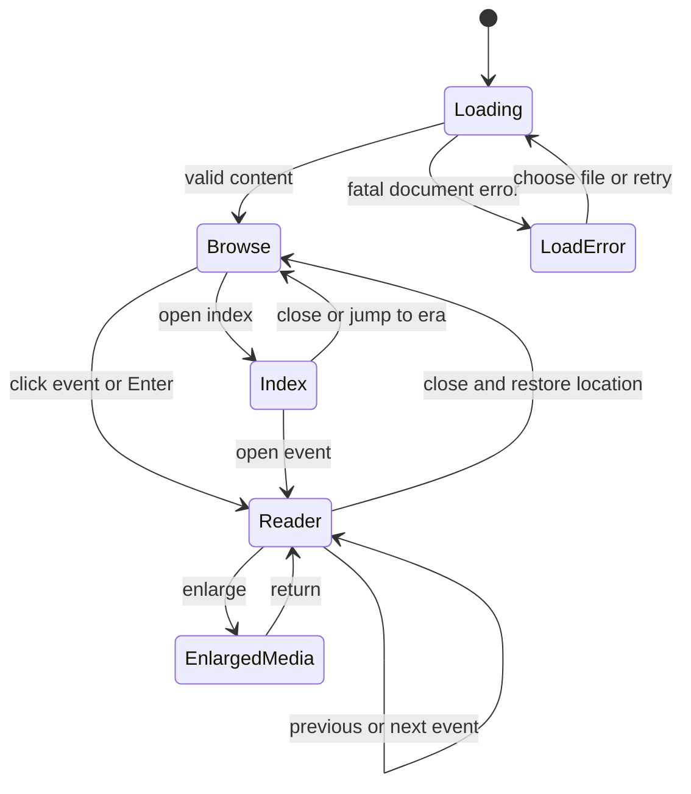

# Galactic Archive — 3D Timeline Design

> Historical vertical specification. The current user-selected direction is a horizontal timeline in a spatial galactic library, with camera orbit around the fixed timeline. See the [V5 concept pack](concepts/spatial-library-v5/README.md) for the current art direction and review of earlier concepts. Vertical placement, fixed-camera restrictions, ornate forms and related acceptance criteria below need reconciliation before implementation. This task creates concept art only.

Status: proposed experience specification. Companion documents: [data contract](timeline-data-contract.md), [asset brief](timeline-asset-brief.md), and [references](timeline-references.md).

## 1. Experience

The timeline feels like a suspended archive of a civilization. A luminous vertical spine descends through a deep, quiet chamber. Small monuments mark eras; framed media exhibits attach to the spine. Moving down reveals later events. Selecting an exhibit brings its image or video and explanatory text into a comfortable reading composition while the archive remains visible behind it.

Foundation suggests three useful themes: historical scale, the preservation of knowledge, and the tension between prediction and change. Translate those themes into restrained monumentality, orderly records, and occasional changes in rhythm. The proposed geometry and palette are original design interpretations, not descriptions of canonical technology. See the [reference guide](timeline-references.md) for the distinction between books, adaptation imagery, and original design.

The principal journey is: enter at the earliest event, descend, recognize an interesting event, open it, read or play its media, close it, and continue from the same location.

## 2. Requirements and boundaries

| Required outcome | Design response |
| --- | --- |
| Godot renders a 3D timeline | Mesh frames, spine, connectors, era structures, lights, and a Camera3D occupy a coherent 3D scene. |
| Earliest content at the top | Down always means later; up means earlier. A persistent directional legend reinforces this. |
| Mouse and keyboard control everything | Every required action has a visible mouse control and keyboard access. No action depends on hover or dragging. |
| Image + text and video + text nodes | Both use one shared exhibit frame and reading layout, with media-specific controls. |
| External JSON owns the content | Events, eras, dates, labels, sources, and media references come from an engine-independent file. |
| Presentation assets must be made | A modular original asset set is specified in the [asset brief](timeline-asset-brief.md). |
| Timeline media supplied separately | Media placeholders are sufficient for future grayboxing; sourcing and downloading actual event media are separate work. |

The first version is a viewer. Editing timelines, free flight, branching alternate histories, VR, multiplayer, live network streaming, and automatic creation of event media are outside its baseline scope. Search and tag filtering are possible later features; the initial design provides direct era navigation and an event index.

## 3. Visual composition

### 3.1 Space and hierarchy

Use five visual layers, ordered from background to foreground:

1. A low-contrast star field or abstract galactic haze, created for this project.
2. Widely spaced architectural ribs and era monuments establishing scale.
3. The timeline spine and its physical connectors.
4. Media frames, date plaques, and short event labels.
5. Screen-space navigation and the optional reading overlay.

The spine remains recognizable at every zoom. Surrounding geometry supplies depth through parallax, bevel highlights, and occlusion without obstructing an interactive frame. Keep the brightest persistent elements on the current event and its connection to the spine. Stars and environmental effects must remain quieter than content.

### 3.2 Browse wireframe

The diagram describes screen composition, not a flat implementation. Frames and connecting arms have physical thickness, and the camera sees their edges.

```text
┌──────────────────────────────────────────────────────────────────────┐
│ GALACTIC ARCHIVE      Current era                     [Index] [Help] │
│ ↑ Earlier                                                [Settings]│
│                           ║                                         │
│ [image exhibit] ────────── ○   date label                       ┌──┐ │
│ Title · short summary     ║                                    │  │ │
│                           ║                                    │▣ │ │
│                  date     ○ ────────── [video poster  ▶]        │  │ │
│                           ║            Title · short summary   │  │ │
│               ═══════ NEXT ERA ═══════                         └──┘ │
│                           ║                       overview scrollbar│
│ [image exhibit] ────────── ○                                         │
│                           ║                                         │
│ ↓ Later    [First] [Previous] [Next] [Last]     [−] [Reset view] [+]  │
│ Event 12 of 100 · Chronological order; spacing is not to scale       │
└──────────────────────────────────────────────────────────────────────┘
```

At a typical desktop size, target three to five legible exhibits in the central region. The viewport may show partial frames above and below as an invitation to move. Event titles should occupy at most two lines in browse mode; summaries at most two short lines. Full text is always available in the reading view.

The overview bar represents progress through **event order**, not elapsed years. Era boundaries and the current position are marked, with a textual event count. The Index panel lists every event in chronological order, grouped by era, including items that are not currently instantiated in 3D.

### 3.3 Reading wireframe

```text
┌──────────────────────────────────────────────────────────────────────┐
│             dimmed 3D archive remains visible behind                │
│   ┌──────────────────────────────────────────────────────────────┐   │
│   │ ERA · DISPLAY DATE                                 [Close]   │   │
│   │ Event title                                                  │   │
│   │ ┌─────────────────────────────┐  Summary                      │   │
│   │ │                             │                              │   │
│   │ │     Image or video          │  Scrollable body text         │   │
│   │ │     original aspect ratio   │  ...                          │   │
│   │ │                             │  ...                          │   │
│   │ └─────────────────────────────┘  Sources / media credit       │   │
│   │ [Play/Pause] [Restart] [Mute] [Volume]  (video only)           │   │
│   │ [Enlarge media]             [Previous event] [Next event]     │   │
│   └──────────────────────────────────────────────────────────────┘   │
└──────────────────────────────────────────────────────────────────────┘
```

The selected 3D frame receives a strong outline and a short, gentle camera centering transition. The reading overlay uses an opaque dark backing for dependable contrast. Its media is a second presentation of the same content, with only one active video decoder. Browsing frames show still posters while the reader plays video.

Use approximately 60% of the reading content width for media and 40% for text on wide displays. When either column becomes too narrow, stack media above text. At 1280 × 720 and 150% text scale, closing, navigation, and media controls must remain available without clipping. Enlarge Media opens a modal media view with a visible return control; it preserves the reader's text position and playback state.

### 3.4 Art direction

| Element | Proposed treatment |
| --- | --- |
| Environment | Blue-black void with faint spatial haze; architectural silhouettes rather than a busy cockpit |
| Spine | Brushed dark metal housing around a thin warm emissive core |
| Event frame | Beveled graphite surround, narrow gold trim, flat neutral media surface |
| Era marker | Larger segmented ring or lintel around the spine, with a readable name plaque |
| Active focus | Cyan bracket plus a distinct outline; shape carries the signal alongside color |
| Selected event | Warm bright connection and solid selection outline; no continuous flashing |
| Type | Readable humanist sans serif for body text; restrained geometric headings; tabular dates where available |
| Motion | Brief easing, subtle light changes, very slow optional ambient motion |

Proposed color tokens: background `#070B14`, panel `#101A29`, metal `#283242`, primary text `#EDF2F7`, secondary text `#B6C1D0`, archive gold `#D4AD68`, focus cyan `#68DAE8`. These are starting values for visual testing, not validated contrast results. Keep the media itself untinted. No text should depend on emission or bloom to be readable.

## 4. Chronology, placement, and camera

The archive runs along world Y: earlier events have higher Y and later events lower Y. The camera looks toward the timeline along negative Z with a fixed orientation and zero roll. Foreground exhibits sit closer to the camera than the structural spine. Decorative depth is shallow enough to avoid dramatic perspective differences between neighbors.

Default spacing is editorial: one chronological event per vertical slot, alternating left and right. Slot index determines placement after sorting the data. A gap of a thousand years does not require a thousand times more travel. Show the dates and the “spacing is not to scale” note; do not add evenly spaced year ticks that imply a true temporal scale.

Events at the same date keep separate slots, share the date label, and can show “same date.” Their tie order is editorial, not a claim that one happened earlier. Events with unknown dates appear in a separate Undated section after the dated archive. Moving into that section updates the directional caption to “Undated records”; its position does not imply later chronology.

Era markers appear before the first event assigned to an era. The data contract requires each era's events to occupy a contiguous block. Empty eras appear as empty sections in the index, without creating unexplained travel distance. For very dense content, the far zoom replaces frame detail with compact labeled markers; the index remains a precise selection path.

Camera movement is constrained to vertical travel and bounded zoom. Mouse-wheel scrolling advances toward later events; dragging empty background upward has the same effect. Camera zoom changes viewing distance while preserving the current event as an anchor. Start with a roughly 40-degree vertical field of view and tune the distance in grayboxing; these are design values, not mandatory engine defaults. No free orbit or mouse-look is required.

At the first and last entries, movement clamps with a quiet endpoint label. Long jumps use a short fade or immediate reposition instead of flying through hundreds of exhibits. New navigation cancels an unfinished centering transition. Reduced Motion makes centering and jumps immediate and disables camera drift and ambient particles.

For large timelines, store the scroll position as a logical position and instantiate a bounded neighborhood around it. Rebase nearby world positions rather than stretching all event coordinates over a huge world. Unloading a frame must never remove its event from keyboard navigation or the index.

## 5. Interaction specification

**Hover** is a mouse preview. **Focus** is the current keyboard target. **Selection** is the event open in the reader. These are distinct states. Hover does not steal keyboard focus. Clicking a frame or its connector marker selects and opens it in one action; keyboard users focus it, then press Enter.

### 5.1 Browse controls

| Action | Mouse | Keyboard |
| --- | --- | --- |
| Move through timeline | Wheel over archive; drag empty background; overview scrollbar | Page Down / Page Up move one visible span |
| Focus next / previous event | Next / Previous buttons | Down / Up when the archive has focus |
| Open focused event | Click frame or marker; Open button in index | Enter when event has focus |
| Go to first / last | First / Last buttons | Home / End when archive has focus |
| Zoom | Plus / minus buttons; Ctrl + wheel over archive | + / − when archive has focus |
| Restore default zoom and center current event | Reset View button | R when archive has focus |
| Open event index | Index button | I when archive has focus |
| Navigate UI controls | Click control | Tab / Shift + Tab; Enter or Space activates buttons |
| Help / Settings | Help / Settings buttons | Tab to button and activate; F1 also opens Help |

Settings also exposes Choose Timeline and Reload Content buttons. Both are reachable with Tab and activated with Enter or Space; the file chooser must support keyboard selection. With no loaded document, the opening screen exposes Choose Timeline directly. Reload is disabled until a document has been chosen. The first event means the earliest dated record, or the first Undated record if the document has no dated events.

When continuous scrolling ends, focus moves to the event nearest the central reading line. Previous/Next moves by event and keeps that event visible. Toolbar button activation preserves toolbar focus while updating the current event. Clicking empty archive background gives the archive keyboard focus without opening a record. After a background drag exceeding 6 logical pixels, releasing must not also activate an event.

The index is modal. Up/Down moves through entries, Enter opens the chosen event, and Escape closes the index. Mouse users click an entry. Era headings can be activated to jump to that era's first event; empty eras cannot be activated. Tab provides access to Close and the list. All modal panels restore focus to their opener on close.

### 5.2 Reading and media controls

| Action | Mouse | Keyboard |
| --- | --- | --- |
| Read long text | Wheel over body; text scrollbar | Focus body with Tab, then arrows or Page Up / Page Down |
| Previous / next record in reader | Previous / Next Event buttons | Alt + Left / Alt + Right |
| Close reader | Close button | Escape |
| Play / pause video | Play/Pause button | Tab to button and activate; Space when the video surface has focus |
| Restart video | Restart button | Tab to Restart and activate |
| Mute or change volume | Mute button / volume slider | Tab to control; Enter for mute, arrows on slider |
| Enlarge media / return | Enlarge Media / Return buttons | Tab and activate; Escape returns from enlarged view first |

Media fills its available rectangle using aspect-preserving containment. Do not stretch or automatically crop an image, portrait video, or captioned footage. The initial enlarged image view offers a larger fitted image; pan and pixel-level inspection can be added later.

Opening video shows its poster and an explicit Play button. No autoplay on hover, selection, or scrolling. Play begins with sound at the user's saved volume; the initial default is 50%. Closing or changing events stops playback, releases its active decoder, and reopening starts at the poster. Enlarge/Return shares the existing playback session. Loss of application focus pauses video; regaining focus requires explicit resumption.

The baseline controls are play/pause, restart, mute, and volume. A noninteractive elapsed-time indicator may be shown. Seeking and timed subtitle tracks are follow-up capabilities that require validation on the pinned engine/backend and representative media. Video records include a transcript so their information can be read without playback.

### 5.3 Input ownership and states

The topmost modal owns input: enlarged media, then Help/Settings/Index, then the reader, then archive navigation. A wheel event consumed by a text panel must never move the camera. Over the rest of an open reader, wheel input does nothing unless it targets a scrollable control. Archive shortcuts are inactive while a modal or text input has focus. Escape closes one layer only. Pending media results are ignored if their event is no longer selected.



Media loading, paused, playing, finished, and unavailable are substates within Reader, not replacements for the main experience. A broken image or video leaves the title, date, text, credit, and navigation usable. Show a neutral placeholder, a short reason, and Retry. Empty valid content shows an empty archive message and Choose Timeline; invalid content shows a load error with a readable location in the JSON. Retry and file selection must work with either input method.

## 6. Readability and accessibility

- Body text starts around 20 logical pixels, with 1.4–1.6 line spacing and a target line length of 55–75 characters in the reader. Provide 100%, 125%, 150%, and 200% text scale settings.
- Target at least 4.5:1 contrast for normal text and 3:1 for large text and meaningful UI boundaries; verify on rendered frames. These are design acceptance targets, not a certification claim.
- Focus is a persistent outline and label treatment, distinguishable from hover and selection. No color-only status, essential flashing, or timed reading tasks.
- Provide image descriptions, visible video transcripts, optional future captions, Reduce Motion, and an Effects Low setting. Keep ambient sound off by default; any later ambient sound has its own mute control.
- Target at least 44 × 44 logical pixels for primary controls and selection hit areas. Small world markers receive larger invisible hit regions.
- Keep the index and reader usable at high text scale. World labels may simplify at distance, but title/date/body remain available in the reader.
- Keyboard access is required. Screen-reader compatibility must be evaluated separately against the eventual Godot build and operating system; it is not established by these documents.

## 7. Godot responsibility map

This is a proposed component design, not a scene file or implementation. Use reusable composed scenes; content does not name these components.

```text
Timeline application
├── Content session: parse, validate, sort, resolve media references
├── Navigation state: current event, logical scroll, selection, return position
├── Archive world (Node3D)
│   ├── Camera rig (Camera3D)
│   ├── Environment, lights, decorative architecture
│   ├── Reusable spine segments and era markers
│   └── Active event neighborhood
│       └── Exhibit: frame mesh, media surface, labels, hit target
└── Interface (CanvasLayer / Control)
    ├── Toolbar, overview, index, settings, help
    ├── Reading panel and enlarged media
    └── Loading, empty, and error feedback
```

Use short `Label3D` labels for world titles and dates; use Control-based text for long reading. Label3D does not inherit a Control Theme, so the presentation layer must apply the shared typography/color tokens to both paths. Its overlap and distance limitations reinforce the need to restrict world text. [Godot: 3D text](https://docs.godotengine.org/en/stable/tutorials/3d/3d_text.html).

Image exhibits use a textured mesh. A future in-world moving-video mode could render a `VideoStreamPlayer` through a `SubViewport` onto the selected mesh; the default reader does not need continuous viewports on every exhibit. Godot documents both the 3D video surface and viewport texture paths. [Playing videos](https://docs.godotengine.org/en/stable/tutorials/animation/playing_videos.html), [SubViewport textures](https://docs.godotengine.org/en/stable/tutorials/shaders/using_viewport_as_texture.html).

Keep static presentation assets in Godot's imported resource workflow. Load external JSON and separately delivered media using runtime file loading. Do not assume a downloaded image already has an editor import record. [Godot: runtime file loading](https://docs.godotengine.org/en/stable/tutorials/io/runtime_file_loading_and_saving.html).

Content records may be adapted into internal typed objects, but those objects are runtime representations of the JSON, not a second editable content source. Presentation resources hold palettes, meshes, materials, layout rules, and effects. User preferences hold volume, text scale, and motion settings. Changing content must not require remaking a mesh; changing the visual theme must not require rewriting content.

## 8. Performance and delivery gates

All numbers below are **proposed budgets to measure**, not benchmark results. Target 60 fps at 1920 × 1080 on a desktop reference machine to be named before implementation. Record CPU, GPU, RAM, engine build, and renderer with measurements. A 30 fps low-effects mode is a fallback target.

Start with no more than 12 instantiated exhibit frames, 24 resident thumbnail textures, one full-resolution active image or video, and one active video decoder. Large jumps should replace the active neighborhood rather than allocate intervening events. Avoid per-frame live lights, dynamic shadows on every card, and layered transparent panels. Stop offscreen media and evict older thumbnails within a fixed memory budget.

The overview and index use lightweight event metadata. Geometry, texture residency, and video decoding should stay bounded as the event count grows. Text metadata can scale with record count. The asset brief defines starting texture and geometry limits.

| Future gate | Evidence required before moving on |
| --- | --- |
| Design review | Agreement on downward chronology, constrained camera, reader overlay, and JSON/visual separation |
| Graybox | Mouse-only and keyboard-only navigation with 20 placeholder events; portrait/landscape layouts; return position preserved |
| Media feasibility | Prepared image and video play in an exported application; verify aspect ratio, audio, pause, close, and missing-file behavior |
| Art slice | One finished spine segment, era marker, and each media node type meet the readability and asset brief |
| Scale pass | 100-event normal dataset and 1,000-event stress dataset; rapid jumps; stable active object count and texture eviction |
| Content handoff | External author can replace/add/reorder events without editing Godot scenes or presentation resources |

## 9. Acceptance scenarios for the future implementation

1. On a fresh launch, a valid timeline opens at its earliest dated event. Downward navigation reveals later records; the direction remains obvious after zooming.
2. A mouse-only user can open the index, select either node type, read full text, operate video, enlarge media, close panels, and change settings.
3. A keyboard-only user can complete the same journey with visible focus. No modal leaks scrolling to the archive. Escape restores the correct layer and focus.
4. Opening and closing a record restores the browse position and zoom. Previous/Next inside the reader updates the eventual return position to the newly viewed event.
5. Equal dates remain deterministically ordered and labeled as equal. Long time gaps do not create unbounded travel. Undated records are visibly separated from chronology.
6. Missing media or a failed decode leaves text readable. A malformed document reports an error and permits retry; an empty document is a valid empty state.
7. A new JSON event appears with a reusable frame. Editing a title or replacing a media path changes the displayed content without an engine-side content edit.
8. At 1280 × 720 with 150% text and at the supported 200% setting with responsive stacking, essential controls and body text remain reachable. Reduced Motion eliminates travel animation.
9. Stress navigation does not create one active video player per record or permanently retain every loaded texture. Measurements satisfy the agreed hardware budgets.

These scenarios are future validation requirements. No runtime implementation or testing has been performed in this documentation task.
